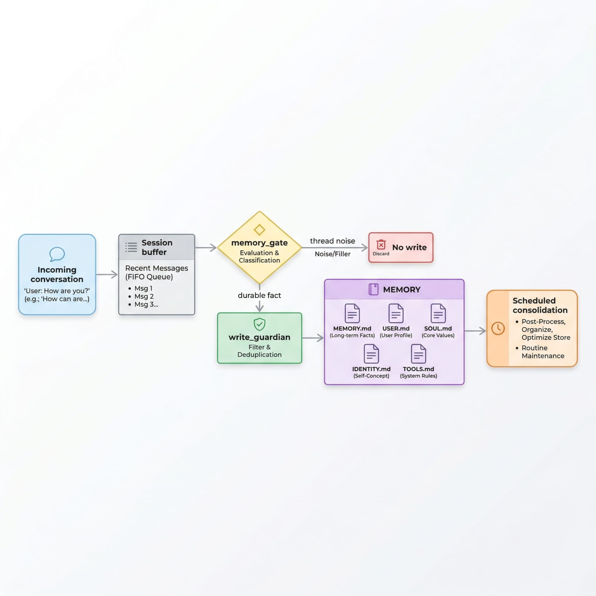

<h1 align="center">OpenClaw Reflection</h1>

<p align="center">
  
</p>

<p align="center"><strong>在不替换 OpenClaw 原生记忆体系的前提下，让 Markdown 记忆更干净、更稳定、更可持续。</strong></p>

英文版： [README.md](./README.md)

<p align="center">
  
  
  
  
</p>

OpenClaw Reflection 是叠加在 OpenClaw 原生 Markdown memory 之上的一层增强插件。它负责监听消息流，过滤线程噪音，把真正长期有效的信息写回 OpenClaw 的核心记忆文件，并定期整理这些文件，避免长期使用后越记越乱。

## 当前支持范围

Reflection 当前支持：

- 单一 agent
- 同一个 agent 下的多 sessions

目前还不支持多 agent 之间的记忆协调，也不支持在一个 OpenClaw 多 agent 环境里做按 agent 分流的长期记忆管理。

## 它建立在 OpenClaw 原生 Memory 之上

OpenClaw 的 memory 本来就是 workspace-native 的：事实源头是 agent workspace 中的 Markdown 文件，而不是隐藏数据库。官方模型里，日常记录通常在 `memory/YYYY-MM-DD.md`，而 `MEMORY.md` 是长期整理层。

Reflection 的定位不是替换，而是增强：

- 不引入新的私有 memory store
- 不要求替换 OpenClaw 默认的 `memory-core`
- 不接管 `plugins.slots.memory`
- 直接围绕现有 Markdown memory 文件做捕获、过滤、路由和整理
- 根据对话，分析整理 `USER.md` `MEMORY.md` `TOOLS.md` `IDENTITY.md` `SOUL.md`

这意味着迁移成本低、概念负担低，也更容易人工检查和版本管理。

## 为什么要装它

Openclaw 默认状态下核心的 `USER.md` `TOOLS.md` `IDENTITY.md` `SOUL.md` 是很难自我迭代改进的

Reflection 就是为了解决这个问题：

- 保留稳定的用户偏好和协作习惯
- 沉淀跨会话仍然有价值的长期上下文
- 将长期记忆拆分到 `MEMORY.md`、`USER.md`、`SOUL.md`、`IDENTITY.md`、`TOOLS.md`
- 拒绝一次性任务、短期线程聊天、错路由内容
- 周期性整理长期记忆，防止文件持续膨胀和失真

## 原理

我们使用 LLM 的能力对最近的对话进行分析，设置了 `memory_gate` 和 `write_guardian` 两个工具

- `memory_gate` 通过对话分析，分析有哪些事实应该被记录到哪个文件

- `write_guardian` 设置为写入门禁，会根据 OpenClaw 官方的指引，来判断是否要写入，并进行事实整合

## 安装

### 推荐方式：安装打包后的插件

更详细的安装指引见 [INSTALL.md](./INSTALL.md)。这个文件现在按“给 OpenClaw 自己执行的安装技能”来写，包含安装前应该向操作者询问哪些配置。

手动直接安装：

```bash
openclaw plugins install @parkgogogo/openclaw-reflection
```

### 添加插件配置

把下面这段配置写到 OpenClaw profile 的 `plugins.entries.openclaw-reflection` 下：

```jsonc
{
  "enabled": true, // 启用这个插件入口
  "config": {
    "workspaceDir": "/absolute/path/to/your-agent-workspace", // 长期记忆文件所在的 agent workspace 目录
    "bufferSize": 50, // 会话缓冲区大小，用来保留最近消息上下文
    "logLevel": "info", // 运行日志级别：debug、info、warn、error
    "llm": {
      "baseURL": "https://openrouter.ai/api/v1", // OpenAI 兼容接口的 provider base URL
      "apiKey": "YOUR_API_KEY", // 用于分析和写入决策的 provider API key
      "model": "x-ai/grok-4.1-fast" // 推荐用于插件运行时的模型
    },
    "memoryGate": {
      "enabled": true, // 启用长期记忆写入前的过滤
      "windowSize": 10 // memory_gate 分析时使用的最近消息窗口大小
    },
    "consolidation": {
      "enabled": false, // 默认禁用；只有需要定时整理时再开启
      "schedule": "0 2 * * *" // 启用 consolidation 后使用的 cron 表达式
    }
  }
}
```

### 重启 OpenClaw Gateway

Gateway 重启后，Reflection 就会开始监听 `message_received` 和 `before_message_write`，并把整理后的长期信息写入你配置的 `workspaceDir`。

### 可观测性命令

- Reflection 现在会给 write_guardian 单独写一份审计日志：
  - `<workspaceDir>/.openclaw-reflection/write-guardian.log.jsonl`
- 当 `logLevel` 为 `debug` 时，Reflection 还会把最近一次 `message_received` callback 的原始 payload 覆盖写入 `logs/debug.json`。
- 当 `write_guardian` 成功写入长期记忆时，Reflection 会给触发这次写入的用户消息补一个 `📝` reaction。
- 注册命令：`reflections`
  - 返回最近 10 条 write_guardian 行为（written/refused/failed/skipped），包含 decision、目标文件和原因。

## 你会得到什么

| 你想要的能力             | Reflection 提供的结果                          |
| ------------------------ | ---------------------------------------------- |
| 可检查、可编辑的记忆系统 | 直接落到 Markdown 文件，能打开、diff、版本管理 |
| 更稳定的跨会话连续性     | 长期事实会被路由到正确的文件                   |
| 更少的记忆污染           | 会过滤临时线程内容和错路由写入                 |
| 长期使用后仍然可维护     | 可选的定期 consolidation，避免文件越来越乱     |

## 它如何工作



流程很直接：

1. Reflection 从 OpenClaw hook 中捕获会话上下文。
2. `memory_gate` 判断候选事实是否足够长期、足够稳定。
3. file-specific `write_guardian` 决定是否写入目标文件，并在需要时重写目标文件内容。
4. 在启用时，`consolidation` 会定期整理长期文件，控制冗余和过时信息。

## 评测覆盖

我们设置了一个小型人工校验过的数据集，使用 x-ai/grok-4.1-fast 来优化 prompt，测试完善 `memory_gate` 和 `write_guardian`

当前默认离线 benchmark 包含：

- `memory_gate`：`18` 个 benchmark case
- `write_guardian`：`14` 个 benchmark case

仓库中最近一次归档结果快照是：

- [`memory_gate`: 16/16 passed on V2](./evals/results/2026-03-08-memory-gate-v2-16-of-16.md)
- [`write_guardian`: 16/16 passed on V2](./evals/results/2026-03-08-write-guardian-v2-16-of-16.md)

这些评测重点覆盖：

- 拒绝当前线程噪音
- 防止用户事实写错文件
- 保持 `SOUL` 连续性规则
- 正确替换过时的 `IDENTITY` 元数据
- 让 `TOOLS.md` 只保存本地工具映射，而不是把它误当工具注册表

## 长期记忆文件

| 文件          | 作用                                           |
| ------------- | ---------------------------------------------- |
| `MEMORY.md`   | 持久共享上下文、关键结论、长期背景事实         |
| `USER.md`     | 稳定的用户偏好、协作风格、长期有帮助的个人背景 |
| `SOUL.md`     | 助手原则、边界、连续性规则                     |
| `IDENTITY.md` | 显式身份元数据，例如名字、气质、形象描述       |
| `TOOLS.md`    | 环境特定的工具别名、端点、设备名、本地工具映射 |

## 开发和评测命令

实际插件使用时，推荐模型：

- `x-ai/grok-4.1-fast`

当前这个仓库里的开发评测配置使用的是：

- eval model: `x-ai/grok-4.1-fast`
- judge model: `openai/gpt-5.4`

```bash
pnpm run typecheck
pnpm run eval:memory-gate
pnpm run eval:write-guardian
pnpm run eval:all

node evals/run.mjs \
  --suite memory-gate \
  --models-config evals/models.json \
  --baseline grok-fast \
  --output evals/results/$(date +%F)-memory-gate-matrix.json \
  --markdown-output evals/results/$(date +%F)-memory-gate-matrix.md
```

`evals/models.json` 只用来定义多模型对比矩阵；共享的 provider endpoint 和 key 仍然来自 `EVAL_BASE_URL` 与 `EVAL_API_KEY`。JSON 输出是后续自动化和历史追踪的基准，Markdown 输出则是给人看的 leaderboard 摘要。

更多评测说明见 [evals/README.md](./evals/README.md)。

## 模型选择

评测日期：`2026-03-09`  
范围：仅 `memory_gate`，共 `18` 个 case，共享 OpenRouter 兼容的 `EVAL_*` 路由

| 模型 | Pass/Total | 准确率 | 错误数 (P/S/E) | 建议 | 适用场景 |
| --- | --- | --- | --- | --- | --- |
| `x-ai/grok-4.1-fast` | `17/18` | `94.4%` | `0/0/0` | 默认基线 | 日常 eval 基线 |
| `qwen/qwen3.5-flash-02-23` | `17/18` | `94.4%` | `0/1/0` | 优秀备选 | 对成本敏感的交叉验证 |
| `google/gemini-2.5-flash-lite` | `16/18` | `88.9%` | `0/0/0` | 便宜快速候选 | 低成本 prompt 迭代 |
| `inception/mercury-2` | `11/18` | `61.1%` | `0/0/0` | 不建议默认使用 | 仅做探索性对比 |
| `minimax/minimax-m2.5` | `9/18` | `50.0%` | `0/0/0` | 不建议默认使用 | 偶尔做 sanity check |
| `openai/gpt-4o-mini` | `4/18` | `22.2%` | `18/0/0` | 当前路由下不建议使用 | 避免在当前 OpenRouter 路径使用 |

如何选择：

- 默认优先用 `x-ai/grok-4.1-fast`，因为这一轮里它的整体稳定性最好，而且没有内部错误。
- 如果想要接近的准确率，同时能接受一次 schema 失败，可以把 `qwen/qwen3.5-flash-02-23` 作为最强备选。
- 如果更看重低成本和快速迭代，可以用 `google/gemini-2.5-flash-lite`，但要接受它在部分 `TOOLS` 边界上略弱。
- 不要把 `inception/mercury-2` 和 `minimax/minimax-m2.5` 当默认基线，因为它们经常把 `SOUL`、`IDENTITY` 或 `NO_WRITE` 判到错误类别。
- 当前 OpenRouter/Azure 路由下不要选 `openai/gpt-4o-mini`，因为 `18` 个 case 全都触发了 provider 侧 structured-output 错误。

源结果见：[2026-03-09-memory-gate-openrouter-model-benchmark.md](./evals/results/2026-03-09-memory-gate-openrouter-model-benchmark.md)

## 链接

- OpenClaw plugin docs: [docs.openclaw.ai/tools/plugin](https://docs.openclaw.ai/tools/plugin)
